  
  <!-- Custom Animated Banner with Left/Right Logos -->
  

  

    <strong>FULL STACK ENGINEER · AI & AUTOMATION ARCHITECT · BACKEND-FIRST · SELF-HOSTED INFRASTRUCTURE</strong>
  

  
  

    <a href="https://macrostasis.dev">🌐 macrostasis.dev</a> · 
    <a href="mailto:metacodex@macrostasis.dev">✉️ metacodex@macrostasis.dev</a> · 
    <a href="https://linkedin.com/in/metacodex">👔 LinkedIn</a>
  

---

### 💻 Sobre Mí

Full Stack Engineer especializado en **.NET 8** y **Python/FastAPI**, con experiencia real en **IA autónoma**, **arquitectura distribuida** y **despliegue autoalojado**. Entrego sistemas completos — de diseño a producción — con documentación técnica exhaustiva y sin necesidad de supervisión constante.

📍 Veracruz, MX (Disponible para trabajo Remoto)

---

### 🏆 Proyectos Destacados

*   **Quantext** `TOP FINALIST · AMD Hackathon 2026`
    *   *Sistema multi-agente adaptativo* con selección dinámica de modelos según la complejidad de la tarea.
    *   *KV-cache quantization* sobre GPU unificada para inferencia local de alta eficiencia en monorepo Next.js + FastAPI.
*   **URMONY** `PRODUCCIÓN`
    *   *Plataforma microfinanciera de ciclo completo*: amortización, intereses moratorios (2.9%/día), 2FA OTP, JWT HttpOnly, PII cifrado (CURP/RFC/teléfono), recibos PDF generados dinámicamente y sistema de tickets.
*   **Parhelion Simulator** `ACTIVO`
    *   *Simulador económico-logístico multijugador en tiempo real* donde las empresas compiten por contratos, subastas y rutas en México.
    *   Motor de ciclos con *Director AI* que genera eventos macroeconómicos dinámicos. Suite de 49 tests de integración concurrentes en Pytest.
*   **OmniDocs** `PRODUCCIÓN`
    *   *Motor de documentación empresarial declarativa* con parser custom de Markdown AST, RAG semántico para consultas rápidas, EventBus asíncrono y colas asyncio.

---

### 🛡️ Ciberseguridad & Logros

*   **Ubisoft CTF 2024 (Captain Laserhawk: The G.A.M.E.)**
    *   Resolución de desafíos críticos de servidor e infraestructura en CTF competitivo internacional.
    *   **Premio obtenido:** 1 ETH.

---

### 🛠️ Stack Tecnológico

#### 🔤 Lenguajes
        

#### ⚙️ Backend
       

#### 🎨 Frontend
       

#### 🗄️ Bases de Datos & Caché
      

#### ☁️ Infraestructura & DevOps
         

#### 🤖 Inteligencia Artificial & Automatización
       

#### 📡 IoT & Hardware
   

---

### 📊 Actividad en GitHub

  <table border="0">
    <tr>
      <td align="center">
        
      </td>
      <td align="center">
        
      </td>
    </tr>
  </table>

---

### 🎧 Escuchando en Spotify (Tiempo Real)

  

---

  Diseño y desarrollo con pasión por <a href="https://macrostasis.dev">macrostasis.dev</a>.

